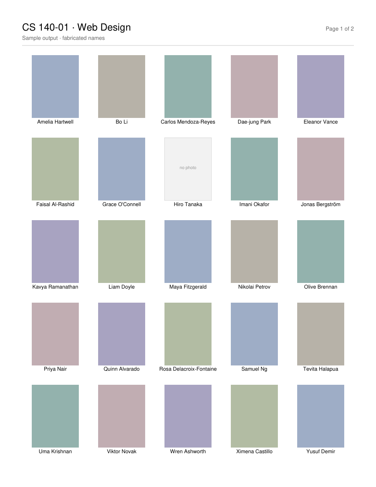

# photoroster

Turn a Workday **View Course Section Roster** PDF export into a one-glance photo
roster: every student's picture and name on a single sheet, with the course
number and title across the top.

The Workday export is a wide landscape table — one student per row, spread over
many pages, with the photo buried among email addresses, credit hours, academic
units and programs of study. Useful for records, useless for learning names.
This script keeps the two columns that matter and lays them out as a grid.



*Sample generated from fabricated names and placeholder tiles — see
[Privacy](#privacy).*

## Requirements

- Python 3.9+
- [PyMuPDF](https://pymupdf.readthedocs.io/)

```bash
python3 -m venv .venv
.venv/bin/pip install -r requirements.txt
```

## Usage

```bash
.venv/bin/python photo_roster.py data/CS_140-01_-_WEB_DESIGN.pdf
```

```
40 students (1 without a photo) -> data/CS_140-01_-_WEB_DESIGN_photo_roster.pdf [2 page(s)]
```

By default the new PDF is written next to the input as
`<input>_photo_roster.pdf`, letter size, five photos across and five down.

### Options

| Option | Description |
| --- | --- |
| `-o`, `--output` | Output path (default: `<input>_photo_roster.pdf`) |
| `--cols`, `--rows` | Grid size (default `5` × `5`, so 25 per page) |
| `--sort` | Sort alphabetically by name instead of keeping roster order |
| `--course` | Override the course number, e.g. `"CS 140-01"` |
| `--title` | Override the course title, e.g. `"Web Design"` |
| `--subtitle` | Replace the line under the heading (default: student count) |

The course number and title are read out of the export's own heading
(`View Course Section Roster: CS 140-01 - WEB DESIGN`), so `--course` and
`--title` are only needed if that heading is missing or you want different
wording.

Bigger faces for a large lecture hall, or a compact sheet for a small section:

```bash
# 4 x 4 = 16 per page, alphabetical
.venv/bin/python photo_roster.py roster.pdf --cols 4 --rows 4 --sort

# 6 x 6 = 36 per page
.venv/bin/python photo_roster.py roster.pdf --cols 6 --rows 6 \
    --subtitle "Fall 2026 - Portable 2 - MWF 9:00"
```

## Privacy

Class rosters are student records. This tool is built to keep them local:

- **No network access.** The script imports `pymupdf`, `argparse`, `re`,
  `pathlib` and `sys`. It makes no HTTP requests and has no telemetry.
- **Nothing personal is committed.** `.gitignore` excludes `data/` and `*.pdf`,
  so neither the export nor the generated roster can be pushed by accident.
  Keep your PDFs in `data/`.
- **The sample image is fake.** `docs/sample.png` is generated by
  `examples/make_sample.py` from invented names and flat colour tiles. Nothing
  in this repository came from a real roster. Regenerate it with
  `.venv/bin/python examples/make_sample.py`.

The output PDF contains the same photos and names as the input, so treat it
like the export itself: keep it off shared drives, and shred the printout when
the term ends. Check your institution's FERPA guidance before distributing it.

## How it works

1. **Find the columns.** The `Photo` and `Student` header labels are located on
   each page and used to derive the x-ranges of those two columns, so the script
   does not depend on hard-coded coordinates.
2. **Rebuild rows from spans.** The export draws an entire table row as a single
   text block spanning many columns, so reading names block-by-block splices
   them together with email addresses. Instead, individual text spans are
   filtered by x-position and regrouped into rows by vertical gap — wrapped
   lines of one name sit about 9pt apart, separate students about 38pt.
3. **Match photos to rows.** Each row occupies a band running from just above
   its first line of text to just above the next student's. A photo belongs to
   whichever band its centre falls in, so a student with no photo on file does
   not shift everyone else by one.
4. **Lay out the grid.** Photos are drawn 3:4 portrait at a size derived from
   the grid dimensions, with the name centred below, wrapped to two lines and
   shrunk from 8.5pt down to 6pt as needed. Students with no photo get a grey
   "no photo" tile.
5. **Fonts.** A Unicode font is embedded only if a name uses characters outside
   Latin-1; otherwise built-in Helvetica keeps the file roughly the size of the
   photos alone. Embedding an unsubsetted Arial Unicode turns a 1.3 MB output
   into a 16 MB one.

## Limitations

- Written against the Workday "View Course Section Roster" export. Other student
  information systems lay their PDFs out differently and will need the column
  detection in `find_columns()` adjusted.
- Photos are used at whatever resolution the export embeds (about 113 × 150 px),
  which is fine for a printed grid but will not enlarge well.
- The Unicode font search covers macOS font paths; on Linux or Windows, pass a
  font by editing `MAC_FONTS`, or accept Helvetica.

## License

[Creative Commons Attribution 4.0 International](https://creativecommons.org/licenses/by/4.0/)
(CC BY 4.0) — see [LICENSE](LICENSE). Use, modify and redistribute it, including
commercially, as long as you credit Christopher Slade and note any changes.

The license covers this code and documentation only. It says nothing about the
rosters you feed it: student names and photos belong to the students and your
institution — see [Privacy](#privacy).
